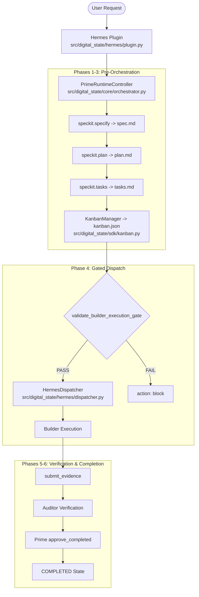

# IMPLEMENTATION PLAN: ORCHESTRATION-003 — RUNTIME WORKFLOW AUTOMATION LAYER

**FEATURE ID:** ORCHESTRATION-003  
**TITLE:** Runtime Workflow Automation Layer  
**GOVERNANCE BASELINE:** ORCHESTRATION-002 (`9e6e96067786265f5556bbf45c3aa1e65d4c0f8e`)  
**STATUS:** SPECIFICATION ONLY (PLANNING PHASE)  

---

## 1. Architectural Architecture & Data Flow

---

## 2. New Components & Integration Points

### 2.1 New Components
1. **`KanbanManager` (`src/digital_state/sdk/kanban.py`):** SDK module for reading, writing, and validating `.specify/kanban.json` assignment cards.
2. **`PrimeRuntimeController` (`src/digital_state/core/orchestrator.py`):** Core orchestrator that executes the sequential Spec Kit skill calls under Prime authority.
3. **`HermesDispatcher` (`src/digital_state/hermes/dispatcher.py`):** Hermes dispatcher layer that bridges Prime orchestration events to Builder dispatch upon gate authorization.

### 2.2 Integration Points
- **Hermes Interceptor:** `DigitalStatePlugin.pre_tool_call_handler()` in `src/digital_state/hermes/plugin.py`.
- **SDK Gate Evaluator:** `validate_builder_execution_gate()` in `src/digital_state/sdk/api.py`.
- **Lifecycle Engine:** `GovernanceKernel.transition()` in `src/digital_state/core/engine.py`.

---

## 3. Security Boundaries & Fail-Closed Controls

1. **ORCHESTRATION-002 Invariance:** Zero changes to `validate_builder_execution_gate()`, `validate_gate_approval()`, or `LifecycleEngine.can_transition()`.
2. **Role Permission Boundary:**
   - `Prime`: Restricted to `["define_goals", "approve_spec", "approve_completed"]`.
   - `Builder`: Restricted to `["submit_plan", "submit_evidence", "execute_tasks"]`.
   - `Auditor`: Restricted to `["approve_plan", "approve_tasks", "approve_spec", "veto_gate", "verify_evidence"]`.
3. **Gate Precedence:** `validate_builder_execution_gate()` MUST evaluate to `True` before `HermesDispatcher` dispatches any execution context to Builder.

---

## 4. Verification Plan

1. **Unit Tests:** `tests/test_kanban_manager.py` & `tests/test_prime_orchestrator.py`.
2. **Integration Tests:** `tests/test_hermes_dispatcher.py`.
3. **End-to-End Test Matrix:** 8-scenario execution matrix verifying automated end-to-end flow from User Request to `COMPLETED` state.
