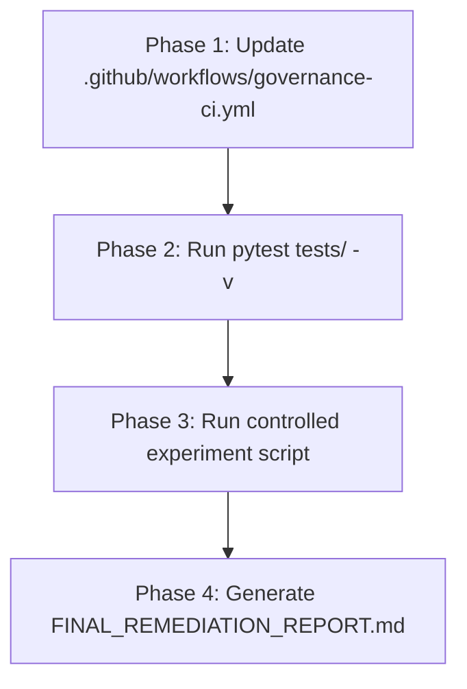

# REMEDIATION PLAN — CI & REPRODUCIBILITY REMEDIATION-001

**GOVERNANCE EVENT:** REMEDIATION-001  
**REPOSITORY:** `samirhosninet/Digital-State`  

---

## 1. Prioritized Action Items

1. **Item 1: Update `governance-ci.yml` Workflow**
   - **Root Cause:** Missing `pip install -e .` step before pytest execution.
   - **Files:** `.github/workflows/governance-ci.yml`.
   - **Implementation Impact:** Adds standard editable package installation step to workflow.
   - **Regression Risk:** Zero. Ensures deterministic package resolution across runner OS environments.
   - **Complexity:** LOW.

---

## 2. Controlled Implementation Sequence

