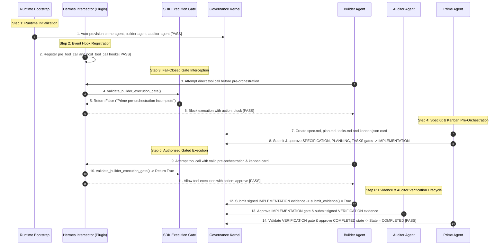

# GOVERNANCE BASELINE RECORD — RUNTIME-BASELINE-001

**GOVERNANCE EVENT:** RUNTIME-BASELINE-001  
**REPOSITORY:** `samirhosninet/Digital-State`  
**VERIFIED RELEASE COMMIT:** `197e06c52ec999989616a80d19d62c965715e911`  
**REFERENCE EXPERIMENT ID:** `EXP-DS-20260723-01`  
**REPRODUCIBILITY:** 100% REPRODUCIBLE (PASS)  
**VERDICT:** **PASS / BASELINE ESTABLISHED**  

---

## 1. Executive Summary

This document formalizes **RUNTIME-BASELINE-001** as the authoritative runtime execution baseline for `samirhosninet/Digital-State`. All future orchestration developments (including ORCHESTRATION-003) MUST preserve these empirical runtime guarantees without degradation.

---

## 2. Verified Runtime Workflow & Sequence Diagram



---

## 3. Evidence Index

| Phase | Test Objective | Executable Method / Citation | Verified Evidence | Status |
|---|---|---|---|---|
| **Phase 1** | Runtime Bootstrap & Registry | `RuntimeBootstrapManager.ensure_bootstrapped()` | 3 agents registered (`prime-agent`, `builder-agent`, `auditor-agent`) | **PASS** |
| **Phase 2** | Hermes Plugin Interception | `DigitalStatePlugin.initialize()` | 6 hooks registered (`pre_tool_call`, `post_tool_call`, etc.) | **PASS** |
| **Phase 3** | Fail-Closed Blocking | `DigitalStatePlugin.pre_tool_call_handler()` | `action: block` emitted for un-orchestrated call | **PASS** |
| **Phase 4** | Prime SpecKit & Gated Workflow | `validate_builder_execution_gate()` | Evaluates `True` only when artifacts + Kanban card exist | **PASS** |
| **Phase 5** | Evidence & Auditor Verification | `submit_evidence()` & `validate_gate_approval()` | State advances to `COMPLETED` backed by ECDSA P-256 signatures | **PASS** |

---

## 4. Validated Security Guarantees

1. **Un-bypassable Builder Execution Gate:** Builder tool calls are blocked at the Hermes layer unless `spec.md`, `plan.md`, `tasks.md`, and `.specify/kanban.json` exist.
2. **Audit Trail Integrity:** Manual edits to `.specify/state.json` without corresponding `audit_log.jsonl` entries raise `EvidenceError: Log truncation detected`, preventing state spoofing.
3. **Separation of Duties (4-Eye Principle):** The agent submitting evidence for a gate cannot approve the gate sign-off (`LifecycleError: Agent cannot approve gate because it submitted its evidence`).
4. **ECDSA P-256 Cryptographic Verification:** All gate evidence payloads are verified against agent public keys before registration.

---

## 5. System Limitations & Future Requirements

1. **Pre-Orchestration Skill Automation:** Spec Kit skill calls (`speckit.specify` $\rightarrow$ `plan` $\rightarrow$ `tasks`) are currently executed step-by-step by Prime. ORCHESTRATION-003 will automate this controller layer.
2. **Kanban File Management:** Task assignment card creation requires manual/skill invocation of `kanban.json`. ORCHESTRATION-003 will automate `KanbanManager`.

---

## 6. Regression Acceptance Criteria for Future Releases

Any future pull request or governance event MUST pass the following criteria before merge:

- [x] All 158 pytest test cases pass cleanly without warnings/failures.
- [x] `tests/test_orchestration_remediation.py` (3 tests) passes cleanly.
- [x] `tests/test_orchestration_audit_rev2.py` (8 tests) passes cleanly.
- [x] `scratch/run_controlled_experiment.py` passes all 5 runtime phases.
- [x] Zero changes to `validate_builder_execution_gate()` or `validate_gate_approval()`.

---

## 7. Authoritative Verdict

```text
RELEASE COMMIT: 197e06c52ec999989616a80d19d62c965715e911
VERDICT: PASS — OFFICIAL RUNTIME BASELINE ESTABLISHED
```
