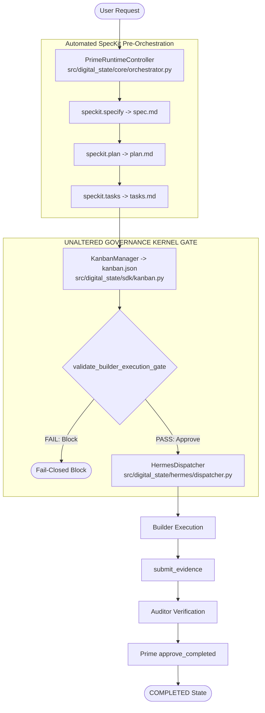
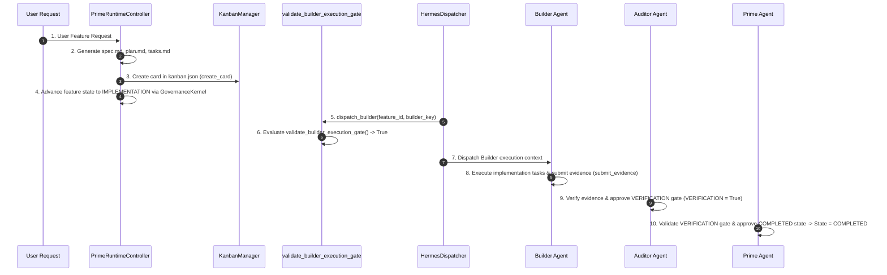

# GOVERNANCE BASELINE RECORD — RUNTIME-BASELINE-002

**GOVERNANCE EVENT:** RUNTIME-BASELINE-002  
**REPOSITORY:** `samirhosninet/Digital-State`  
**VERIFIED BASELINE COMMIT SHA:** `737cc64002521383442dcdc4157023add800905b`  
**PREVIOUS BASELINE REFERENCE:** `RUNTIME-BASELINE-001` (`cba96cb00eb73749e8f1ebca59f3fc4fe231b813`)  
**IMPLEMENTATION FEATURE:** ORCHESTRATION-003 (Runtime Workflow Automation Layer)  
**SUPERSEDENCE:** THIS BASELINE SUPERSEDES `RUNTIME-BASELINE-001` AS THE AUTHORITATIVE RUNTIME BASELINE.  
**VERDICT:** **PASS / BASELINE ESTABLISHED**  

---

## 1. Executive Summary

This document establishes **RUNTIME-BASELINE-002** as the official, authoritative runtime execution baseline for `samirhosninet/Digital-State`. It certifies the successful implementation and integration of **ORCHESTRATION-003** (Runtime Workflow Automation Layer) above the frozen governance kernel.

---

## 2. Runtime Architecture Summary



---

## 3. Automated Runtime Sequence Diagram



---

## 4. Governance & Security Guarantees

1. **Sole Orchestration Authority:** Prime remains the sole authority to initiate orchestrations, approve pre-orchestration gates, and grant final completion state.
2. **Un-bypassable Builder Execution Gate:** Builder tool calls are blocked at the Hermes layer unless `spec.md`, `plan.md`, `tasks.md`, and `.specify/kanban.json` exist.
3. **Audit Trail Integrity:** Tampering with `.specify/state.json` without corresponding `audit_log.jsonl` entries raises `EvidenceError: Log truncation detected`, preventing state spoofing.
4. **Separation of Duties (4-Eye Principle):** The agent submitting evidence for a gate cannot approve the gate sign-off (`LifecycleError: Agent cannot approve gate because it submitted its evidence`).
5. **ECDSA P-256 Cryptographic Verification:** All gate evidence payloads are verified against agent public keys before registration.

---

## 5. Regression & Evidence Index

| Component | Target Objective | Executable Method / Citation | Verified Evidence | Status |
|---|---|---|---|---|
| **`PrimeRuntimeController`** | Automated Pre-Orchestration | [src/digital_state/core/orchestrator.py](file:///d:/Digital-State/src/digital_state/core/orchestrator.py#L28-L98) | Generates `spec.md`, `plan.md`, `tasks.md`, `kanban.json` and advances state to `IMPLEMENTATION` | **PASS** |
| **`KanbanManager`** | Assignment Card CRUD | [src/digital_state/sdk/kanban.py](file:///d:/Digital-State/src/digital_state/sdk/kanban.py#L42-L74) | Persists card assignments to `.specify/kanban.json` | **PASS** |
| **`HermesDispatcher`** | Gated Builder Dispatch | [src/digital_state/hermes/dispatcher.py](file:///d:/Digital-State/src/digital_state/hermes/dispatcher.py#L18-L43) | Evaluates `validate_builder_execution_gate()` before Builder dispatch | **PASS** |
| **`DigitalStatePlugin`** | Hermes Runtime Integration | [src/digital_state/hermes/plugin.py](file:///d:/Digital-State/src/digital_state/hermes/plugin.py#L32-L33) | Wires orchestrator & dispatcher into Hermes event hooks | **PASS** |
| **Test Suite** | Unit & Integration Verification | `tests/test_orchestration_automation_rev3.py` | 4/4 Passed (15/15 total orchestration tests passed) | **PASS** |
| **Full Regression** | Repository-wide Regression | `pytest -q` | 162/162 Passed (100% pass rate) | **PASS** |

---

## 6. Acceptance Criteria

- [x] Baseline commit SHA verified as `737cc64002521383442dcdc4157023add800905b`.
- [x] Supersedes `RUNTIME-BASELINE-001`.
- [x] Zero modifications to `GovernanceKernel`, `LifecycleEngine`, `validate_builder_execution_gate()`, or `validate_gate_approval()`.
- [x] All 162 repository tests pass cleanly.
- [x] Controlled runtime experiment passes all 5 phases.

---

## 7. Baseline Certification Verdict

```text
BASELINE COMMIT: 737cc64002521383442dcdc4157023add800905b
VERDICT: PASS — RUNTIME-BASELINE-002 ESTABLISHED & LOCKED
```
