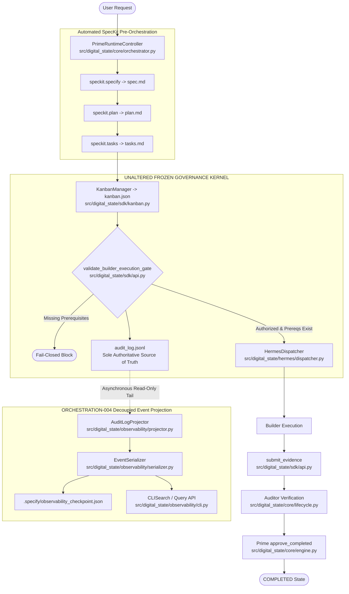

# GOVERNANCE BASELINE RECORD — RUNTIME-BASELINE-003

**GOVERNANCE EVENT:** RUNTIME-BASELINE-003  
**REPOSITORY:** `samirhosninet/Digital-State`  
**VERIFIED BASELINE COMMIT SHA:** `b40dbdb74f4759d8bee917c1e7e521dec13a6240`  
**PREVIOUS BASELINE REFERENCE:** `RUNTIME-BASELINE-002` (`737cc64002521383442dcdc4157023add800905b`)  
**IMPLEMENTATION FEATURE:** ORCHESTRATION-004 (Decoupled Log-Stream Event Projection & Observability Engine)  
**SUPERSEDENCE:** THIS BASELINE SUPERSEDES `RUNTIME-BASELINE-002` AS THE AUTHORITATIVE RUNTIME BASELINE.  
**VERDICT:** **PASS / BASELINE ESTABLISHED & FROZEN**  

---

## 1. Executive Summary

This document establishes **RUNTIME-BASELINE-003** as the official, authoritative runtime execution baseline for `samirhosninet/Digital-State`. It certifies the successful implementation, integration, and independent verification of **ORCHESTRATION-004** (Decoupled Log-Stream Event Projection & Observability Engine).

All future engineering and governance events MUST inherit from **RUNTIME-BASELINE-003** without modifying frozen components.

---

## 2. Runtime Architecture Summary



---

## 3. Component Verification Summary

| Subsystem Component | File Path | Scope & Status |
|---|---|---|
| **`AuditLogProjector`** | [`src/digital_state/observability/projector.py`](file:///d:/Digital-State/src/digital_state/observability/projector.py) | Asynchronous read-only log tailing outside lock boundaries |
| **`CheckpointManager`** | [`src/digital_state/observability/checkpoint.py`](file:///d:/Digital-State/src/digital_state/observability/checkpoint.py) | Sequence offset checkpoint persistence |
| **`EventSerializer`** | [`src/digital_state/observability/serializer.py`](file:///d:/Digital-State/src/digital_state/observability/serializer.py) | SHA-256 hash chain and entry schema verification |
| **`ProjectionEngine`** | [`src/digital_state/observability/engine.py`](file:///d:/Digital-State/src/digital_state/observability/engine.py) | Filtering events by `event_type`, `agent_id`, `feature_id` |
| **`CLISearch`** | [`src/digital_state/observability/cli.py`](file:///d:/Digital-State/src/digital_state/observability/cli.py) | Read-only query CLI interface |

---

## 4. Frozen Governance Components (Immutable Reference)

The following components are strictly frozen and MUST remain untouched:

1. `GovernanceKernel` ([src/digital_state/core/engine.py:L40-L299](file:///d:/Digital-State/src/digital_state/core/engine.py#L40-L299))
2. `LifecycleEngine` ([src/digital_state/core/lifecycle.py:L90-L185](file:///d:/Digital-State/src/digital_state/core/lifecycle.py#L90-L185))
3. `validate_builder_execution_gate()` ([src/digital_state/sdk/api.py:L17-L115](file:///d:/Digital-State/src/digital_state/sdk/api.py#L17-L115))
4. `validate_gate_approval()` ([src/digital_state/sdk/api.py:L116-L165](file:///d:/Digital-State/src/digital_state/sdk/api.py#L116-L165))
5. `RuntimeBootstrapManager` ([src/digital_state/bootstrap/manager.py](file:///d:/Digital-State/src/digital_state/bootstrap/manager.py))
6. `DigitalStatePlugin` ([src/digital_state/hermes/plugin.py](file:///d:/Digital-State/src/digital_state/hermes/plugin.py))
7. `PrimeRuntimeController` ([src/digital_state/core/orchestrator.py](file:///d:/Digital-State/src/digital_state/core/orchestrator.py))
8. `HermesDispatcher` ([src/digital_state/hermes/dispatcher.py](file:///d:/Digital-State/src/digital_state/hermes/dispatcher.py))
9. `KanbanManager` ([src/digital_state/sdk/kanban.py](file:///d:/Digital-State/src/digital_state/sdk/kanban.py))

---

## 5. Regression & Certification Matrix

- [x] **Git Diff Audit:** 0 lines modified in all 9 frozen components vs `RUNTIME-BASELINE-002`.
- [x] **Full Regression Suite (`pytest -q`):** 166/166 Passed (100% pass rate).
- [x] **Orchestration & Observability Matrix:** 19/19 Passed across remediation, rev2 audit, rev3 automation, and rev4 observability test suites.
- [x] **Controlled Runtime Experiment (`scratch/run_controlled_experiment.py`):** 5/5 Phases Passed.
- [x] **Failure Injection:** Projector errors isolated with 0 impact on `GovernanceKernel`.
- [x] **Adversarial Architecture Audit:** Passed with 0 vulnerabilities detected.

---

## 6. Official Promotion Verdict

```text
BASELINE COMMIT: b40dbdb74f4759d8bee917c1e7e521dec13a6240
SUPERSEDED BASELINE: RUNTIME-BASELINE-002
STATUS: PASS — RUNTIME-BASELINE-003 ESTABLISHED & FROZEN
```
