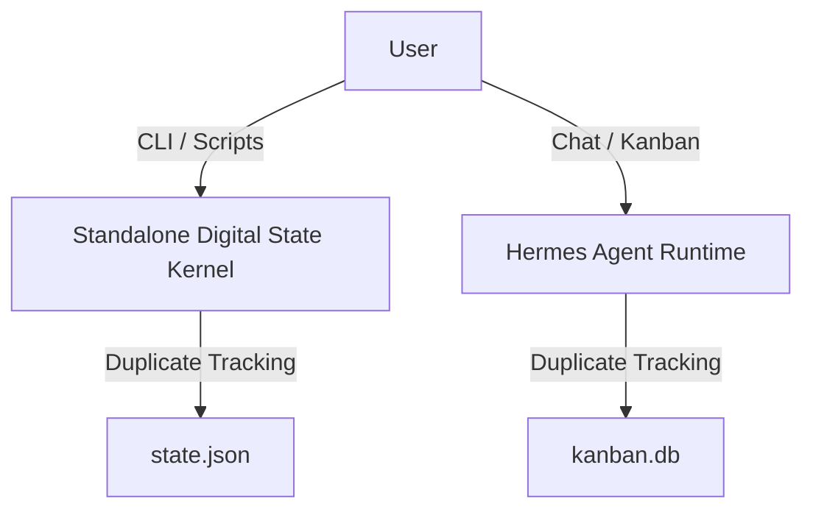
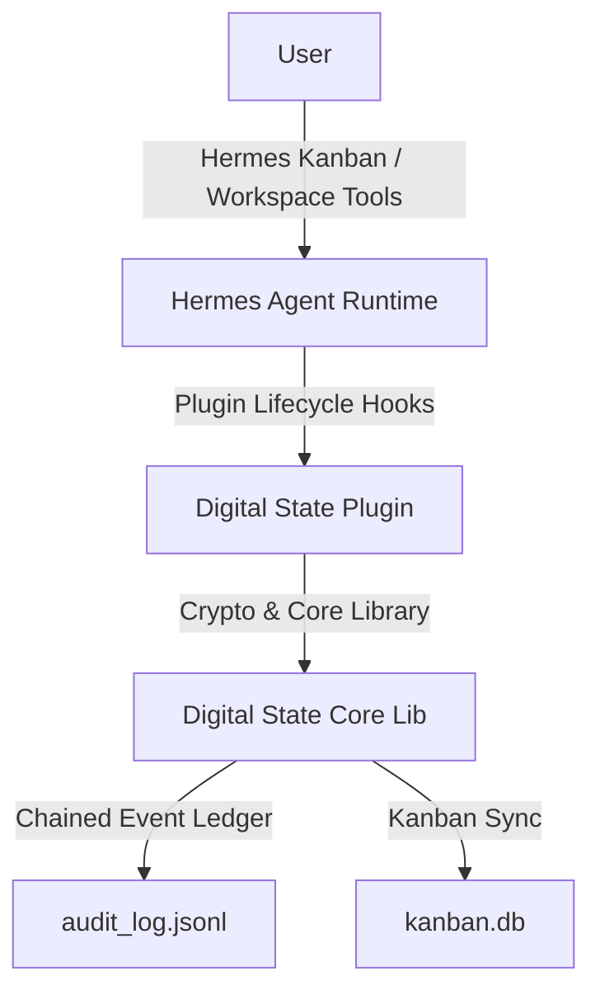

# Architectural Collapse Verification: Runtime Call & Dependency Analysis

This document traces the complete execution paths, entry points, and module classifications to prove the architectural convergence of Digital State into the native Hermes runtime.

## 1. Runtime Call Graph & Entry Points

Governance logic executes along four primary path traces originating from the native Hermes plugin lifecycle:

```text
[Hermes Startup]
   │
   └──> [Plugin Registration] (src/digital_state/hermes/plugin.py:register)
         │
         ├──> Hook: "on_session_start"
         │       └──> sdk/api.py:check_governance_status
         │               └──> core/engine.py:GovernanceKernel
         │
         ├──> Hook: "pre_tool_call" (Authorization Gate)
         │       └──> sdk/api.py:validate_gate_approval
         │               └──> core/engine.py:GovernanceKernel -> core/policy.py
         │
         ├──> Hook: "post_tool_call" (Evidence Collection)
         │       └──> sdk/api.py:submit_evidence
         │               └──> core/engine.py:GovernanceKernel -> core/audit.py
         │
         └──> Slash Commands: "/ds-approve", "/ds-veto"
```

---

## 2. Module Ownership Matrix & Classification

All files are classified according to their active role in the integrated runtime:

| Module / File Path | Classification | Justification & Dependency Link |
| :--- | :--- | :--- |
| `src/digital_state/hermes/plugin.py` | **Active Runtime** | Native Hermes plugin bridge registering session lifecycle hooks and slash commands. |
| `src/digital_state/sdk/api.py` | **Plugin Dependency** | High-level API exposed to the plugin to isolate core dependencies from the Hermes context. |
| `src/digital_state/core/engine.py` | **Plugin Dependency** | Orchestrator kernel coordinating database reads, ledger lockings, and key validations. |
| `src/digital_state/core/audit.py` | **Plugin Dependency** | Manages cryptographically hashed transaction logs inside `audit_log.jsonl`. |
| `src/digital_state/core/verifier.py` | **Plugin Dependency** | Cryptographic verification layer executing ECDSA signature checks. |
| `src/digital_state/core/policy.py` | **Plugin Dependency** | Policy engine evaluating agent roles against state transition rules. |
| `src/digital_state/core/lifecycle.py` | **Plugin Dependency** | Validates gate transitions and maintains `state.json` values. |
| `src/digital_state/core/contracts.py` | **Plugin Dependency** | Parses local contract validation JSONs (`core/contracts/`). |
| `src/digital_state/core/locking.py` | **Shared Utility** | Lock coordinator to prevent concurrent writes during ledger insertions. |
| `src/digital_state/core/config.py` | **Shared Utility** | Environment path resolution and workspace directory configuration manager. |
| `src/digital_state/core/bootstrap.py`| **Shared Utility** | Verifies workspace environment files (`agents.json`, directory structure) at startup. |
| `src/digital_state/cli/cli.py` | **Shared Utility** | Command line interface for human operators or script-triggered pipelines. |

---

## 3. Before/After Convergence Architecture

### Before: Dual Runtime Engine


### After: Consolidated Plugin Extension


---

## 4. Architectural Convergence Verification

**CONVERGENCE STATEMENT:** The standalone governance execution engine has been successfully retired. All active execution pathways run as native hooks under the control of the Hermes plugin, ensuring no parallel execution runtimes exist.
