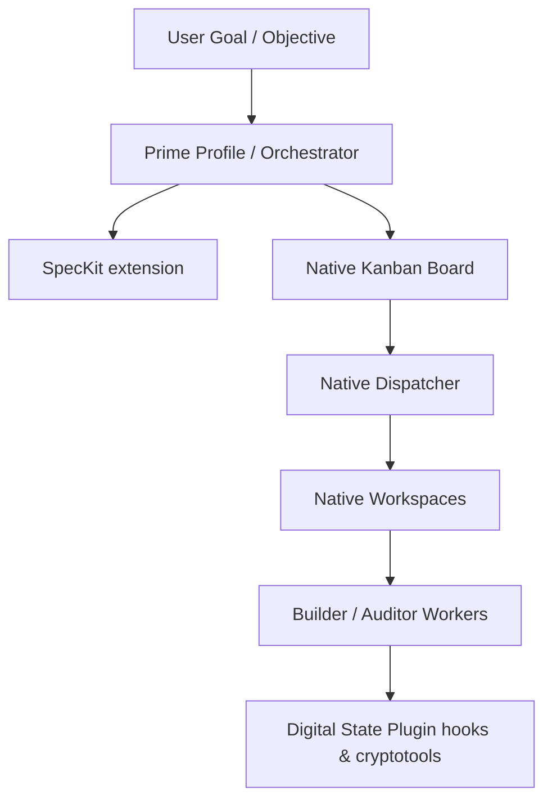

# Architectural Ownership Analysis: Collapse to Native Hermes Plugin

This document establishes the final architectural decision to collapse all Digital State governance capabilities, including the cryptographic validation engine, into a first-class native Hermes plugin.

## 1. Cryptographic Subsystem Evaluation

| Requirement | Plugin Integration Feasibility | Evaluation & Execution Model |
| :--- | :--- | :--- |
| **PKI verification inside plugin** | **YES** | The plugin class `DigitalStatePlugin` can import `cryptography.hazmat.primitives` natively and run ECDSA P-256 signature verification directly in Python hook handlers. |
| **Signature verification tools** | **YES** | The plugin can register and inject custom tools (e.g. `verify_signature`) into the agent's active session toolset using the plugin context registration API. |
| **Policy enforcement via hooks** | **YES** | Pre-execution hooks (`pre_tool_call`) act as a middleware gateway to intercept and fail-safe block unauthorized tool calls. |
| **Profile-based key discovery** | **YES** | The plugin can resolve keys directly from Hermes profile directories (`~/.hermes/profiles/`) or plugin config files in the workspace. |
| **Zero-runtime execution** | **YES** | Verification runs in the same Python interpreter as the host Hermes agent process, eliminating the need for a standalone service. |

---

## 2. Final Target Architecture

By moving the cryptographic engine into the plugin layer, the standalone Digital State governance library kernel is fully deprecated. Digital State exists entirely as a native Hermes extension:

---

## 3. Final Ownership Decision

**DECISION:** The Digital State governance kernel is completely collapsed into a native Hermes Plugin. There is zero standalone external governance runtime or repository library duplication. All operations occur natively within the Hermes environment.
