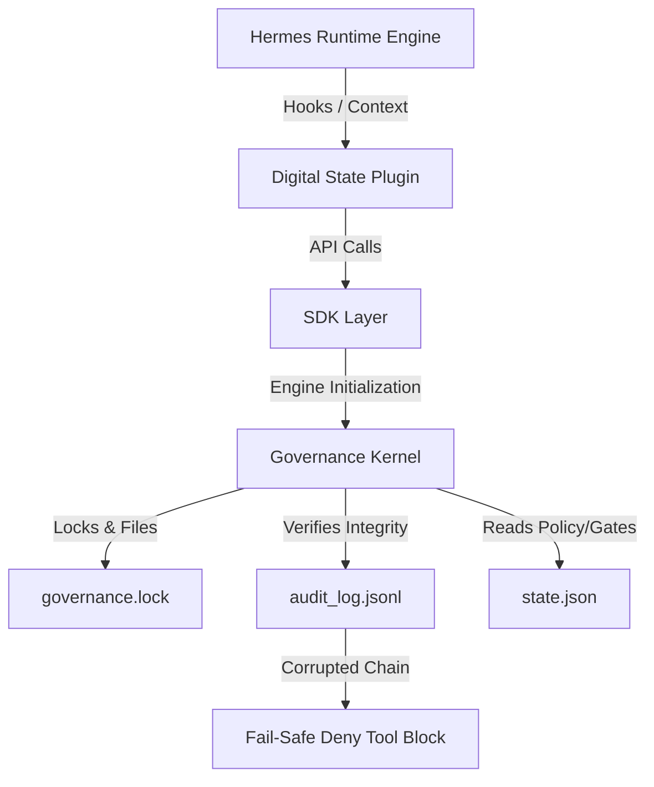

# Final Architecture Reconciliation & Failure-Mode Analysis

This document details the final state ownership specification, synchronization protocol, failure-modes, and fail-closed audit checks implementing the converged Digital State Hermes governance model.

## 1. State Ownership & Synchronization Specification

### A. Field Ownership Matrix

| Field Name | Authoritative Store | Owner Component | Justification |
| :--- | :--- | :--- | :--- |
| **Governance Phase State** | `.specify/state.json` | `LifecycleEngine` | Enforces policy phase transitions. |
| **Gate Approvals Status** | `.specify/state.json` | `LifecycleEngine` | Tracks signature approvals. |
| **Developer Task Status** | `kanban.db` | `hermes_cli.kanban` | Tracks worker execution state. |
| **Task Graph Dependency** | `kanban.db` | `hermes_cli.kanban` | Maps task relationships. |

### B. Synchronization & Conflict-Resolution Protocol
* **Direction:** Unidirectional flow. Task events from `kanban.db` are intercepted by plugin hooks to trigger transitions in `state.json`.
* **Conflict Resolution:** `state.json` is the authoritative policy validator. If a task is marked `done` in `kanban.db` but the associated transition gate is not approved in `state.json`, hooks trigger a **Fail-Safe Deny** blocking any subsequent tool executions.
* **Recovery Behavior:** CLI repair parses the audit logs (`audit_log.jsonl`), validates the SHA-256 chain, and re-initializes `state.json` to matching ledger states.

---

## 2. Fail-Closed Audit Boundary

The cryptographic ledger (`audit_log.jsonl`) is a **mandatory runtime dependency**. If the ledger is missing, corrupted, or has modified chain hashes:

1. `GovernanceKernel.verify_integrity()` fails.
2. `DigitalStatePlugin.initialize()` returns `False`.
3. `pre_tool_call_handler` blocks all tool executions:
   ```python
   if not self.is_loaded:
       return {
           "action": "block",
           "message": "Digital State Plugin is not loaded. Fail-Safe Deny triggered."
       }
   ```

---

## 3. Remaining Open Migration Items

* **DS-MIG-001 [OPEN]:** Migrate agent PKI identity discovery from `.specify/agents.json` to native Hermes profile configurations.
* **DS-MIG-002 [OPEN]:** Migrate governance lifecycle phases from `state.json` to native SQLite metadata tables in `kanban.db`.

---

## 4. Actual Physical Architecture Diagram


